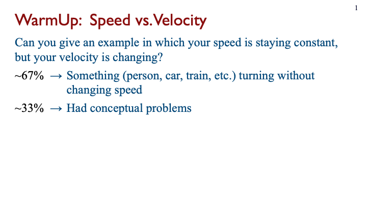
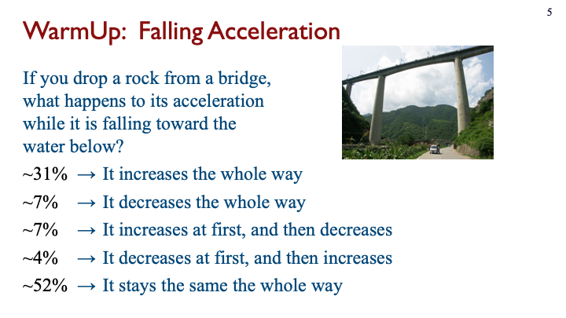

# Design spike 3 for [jitt](https://github.com/ivogeorg/jitt)

[[taag](https://patorjk.com/software/taag/#p=display&f=Big&t=something)]
```
  _____                                                 
 |_   _|                                                
   | |  _ __    _ __  _ __ ___   __ _ _ __ ___  ___ ___ 
   | | | '_ \  | '_ \| '__/ _ \ / _` | '__/ _ \/ __/ __|
  _| |_| | | | | |_) | | | (_) | (_| | | |  __/\__ \__ \
 |_____|_| |_| | .__/|_|  \___/ \__, |_|  \___||___/___/
               | |               __/ |                  
               |_|              |___/                   
```
                                                                       
Table of Contents
=================

* [Design spike 2 for <a href="https://github\.com/ivogeorg/jitt">jiit</a>](#design-spike-2-for-jiit)
* [User stories](#user-stories)
  * [1\. Instructor stories](#1-instructor-stories)
    * [1\.1\. Question banks](#11-question-banks)
    * [1\.2\. Cards](#12-cards)
  * [2\. Student stories](#2-student-stories)
* [Data](#data)
  * [1\. Instructor](#1-instructor)
  * [2\. Class](#2-class)
  * [3\. Student](#3-student)
  * [4\. Meeting](#4-meeting)
  * [5\. Question](#5-question)
  * [6\. Answer](#6-answer)
  * [7\. Digest](#7-digest)
        * [Preliminary notes](#preliminary-notes)
* [Views](#views)
* [Workflows](#workflows)
* [Implementation notes](#implementation-notes)
* [Open questions](#open-questions)


# User stories

## 1. Instructor stories

1. I want to ask my students a small number of _warmup questions_ (see [Question](#question)) before every class period (see [Meeting](#meeting)).
3. I want to be able to quickly review the answers (see [Answers](#answers)), possibly group them, and select some as discussion triggers (aka hooks, engagement elements, etc.) for class.  
   1. View all answers to a given question in one compact list, with simple row highlighting to make it easy to tell between adjaced student answers. ~~This can be thought of as _manual clustering_.~~  See the following examples: 
      Slide | Description
      --- | ---
        |  Contains a summary of a popular answer and a general "Conceptual problems" cluster/pool
        |  Contains two anonymized sample answers
        |  Contains three clusters with brief description
        |  Contains two anonymized sample (parts of) answers
        |  For a multiple-choice question, provides percentages for each answer
   2. _Manual clustering_ may have a very interesting UX/UI, in which, while the instructor is reviewing the answers, they can create clustering on the fly:
      1. If there is already a cluster category matching the highlight for an answer, it is selected to flag the answer.
      2. If an answer does not match any of the already available cluster categories, it is created on the fly, the answer is automatically flagged with it, and the category is added to the available one.
      3. Each set of cluster categories defines one "dimension". Multiple dimensions may be supported easily with the same UX/UI. A visual example:
         ```
         ---------------          ---------------          
         | DIMENSION 1 |          | DIMENSION 2 |          
         ---------------          ---------------          
         | Category 1  |          | Category 1  |          
         ---------------          ---------------          
         | Category 2  |          | Category 2  |          
         ---------------          ---------------          
         | Category 3  |          
         ---------------          
         | Category 4  |          
         ---------------          
         ```
      4. This is just like adding new folders in Outlook (which is overly clunky), O'Reilly's lists, or SparkFun's lists.  *[Applying labels in Gmail might be a good example. It is very fast, and has a lot of the features you describe.]*
      5. Automtic clustering can be presented in the same UX/UI, just populating the cluster dimensions and categories.
   3. Sort student responses in a few ways. For example:
      1. By timestamp.
      2. Alphabetical by last name.
      3. Randomized. 
      4. Instructor requests "Random 15 responses at the top, from those I have seen the least." The system tallies which students are displayed at the top. The next time, those with the lowest tally are shown at the topc.
4. I want to be able to load up questions for the class periods for a whole semester, and have the flexibility to adjust to the way the specific class is moving through the material. Easily move a question from one WarmUp to another, change the order of WarmUps. Here, "WarmUp" is funcitonally synonymous to class period or "Meeting" (see [Meeting](#meeting)). [WarmUP should be distinct from "Meeting" some isntructors give one WarmUp each week, covering 2 class meetings, for example.]  
5. I want to be able to import questions:
   1. From csv, spreadsheet, etc. and then arrange them.  
   2. From a previous edition of the same class.  
6. I want to be able to export questions to csv or spreadsheet.  
7. I want to be able to edit the text of a question, both while it is unassigned (that is, in a [question bank](#11-question-banks)) and assigned (so the unassigned and assigned can differ).  
8. I want the option to have the computer assign grades automatically (auto-grade) to student responses.  
   1. Select mode:
      1. Auto-grade for participation. For example, on a 0-2 scale, default to 1 for having provided an answer and 0 for no answer. 
      2. Auto-grade for correctness, for questions which have correct answers (e.g. multiple-choice, single-answer or multiple-answer, questions).
      3. No auto-grade (meaning, manual grading only). 
   2. Customize point value per question. That is, the scale is definable.   
   3. Manually adjust the grade for a student response at the same time (same view) as reviewing responses. Simple +/- buttons to increase/decrease grades.  
9. Email individual students (from my default email client) about their response with one click from the basic "view responses" view.  
   1. Emails are based on templates.
   2. A template should be prifilled with available slot data. For example:
      1. Subject line.
      2. Greeting.
      3. The question.
      4. The addressee student's answer.
      5. Instructor signature.
   3. This feature may be scaled with clustering (a la [sense education](https://www.sense.education/):
      1. Grouping answers per question.  
      2. Clustering of a question's answers.
      3. Collecting instructor feedback on each cluster.
      4. Assembling instructor feedback for for each student (for all answered question).
      5. Mailing feedgack to each student.
10. During class meeting, I want to show some curated information from the warmups:  
    1. Question text and images. These suppot are points of engagement. For example:
       1. Remind students what the question was about.   
       2. Show how many students didn't do it.  
    2. Aggregate responses categorized by the instructor when reading a sample of student responses. (see slide examples above)
    3. Anonymous responses from some students, especially the "useful wrong answers".  
11. Ideally the student view of questions is LMS embeddable.  

### 1.1. Question banks

1. Questions can be flagged with conceptual topics.  
2. Questions can be flagged with question level, most likely to follow adopted and/or conventional scale of academic difficulty. 
   1. For example, for physics, these can be:
      1. Conceptual.  
      2. Algebra-based.   
      3. Calculus-based. 
      4. Upper-division.  
      5. Graduate-level.  
   2. This is a first step toward figuring out how to maintain domain knowledge in a hierarchy of academic difficulty.
   3. In general, these levels should be configurable by the instructor, though concensus and normativity are desired.  
3. Quesitons can be searched by users based on:
   1. Author.  
   2. Topic.  
   3. Question level.  
   4. Date.  
   5. Course name.   
   
### 1.2. Cards

_Notes: Cards are semi-independent embeddable interactive units of rich multimedia content._

1. What is a card good for:
2. What can be a card:
   1. Questions, by default. 
   2. Answers, if interactive may optionally be, especially in the interactive case.
   3. Curated results in class.
3. What may a card contain:
   1. Textual paragraphs.
   2. Formulae.
   3. Images.
   4. Embedded video.
4. In general, cards should support a full (initially 2D) pallete of formatting options, organized as a set of content-dependent rich editors. _Note that the **bang-for-the-buck** declines sharply for such editors. The range is from **HTML** (or **LaTeX**, or **Photoshop**) to **Markdown**. Err on the side of simplicity._


## 2. Student stories

1. I want to have an easy interface to answer _warmup questions_ on any device.  
2. I want to have alerts about the pre-class deadlines for _warmup questions_.  
3. I want to be able to edit my answers before the corresponding deadline.  
4. I want to have the questions sent to me over email and apps that I use (e.g. Teams, FB Messenger).  
5. I want to be able to review questions, my responses and the grades I got, after the deadline.  

# Design spike protocol

1. Review [stories](#user-stories).  
2. Answer [open questions](https://github.com/ivogeorg/jitt/blob/main/design-spike-2.md#open-questions).  
3. Integrate notes on [digests](https://github.com/ivogeorg/jitt/blob/main/design-spike-2.md#7-digest).  
4. Update [stories](#user-stories).  
5. Integrate notes on [views](https://github.com/ivogeorg/jitt/blob/main/design-spike-2.md#views).  
6. Design all [views](#views) based on [stories](#user-stories).  
7. Integrate notes on [workflows](https://github.com/ivogeorg/jitt/blob/main/design-spike-2.md#workflows). Workflows are a graph of [views](#views).  
8. Design all [workflows](#workflows) on the view graph.  
9. Design core [data](#data) using:
   1. GUID.  
   2. Description of relation to other _core data_.
      1. Associations can be many-many, many-one, one-to-many, and one-to-one.  
      2. Mappings are usually one-to-one or one-to-many (dictionary). In the one-to-one case they are _equivalences_.  
   3. **Unique**, e.g. email address.
   3. _Optional_, usually for _non-core data_.


# Views

# Workflows

# Data

