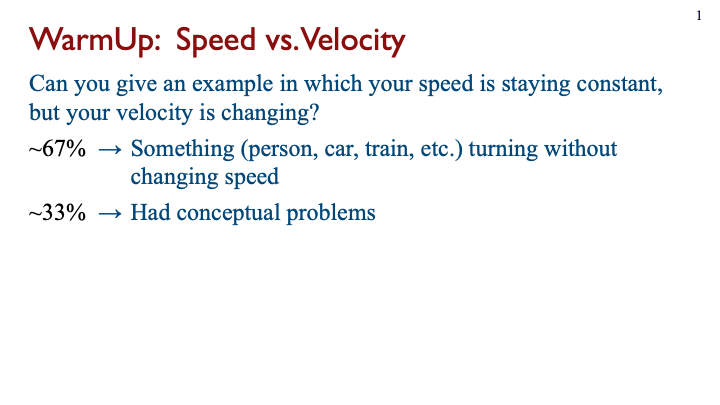
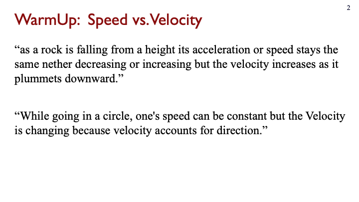
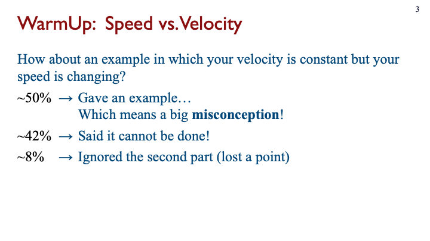
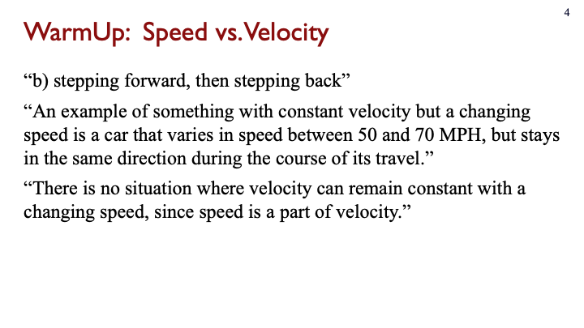
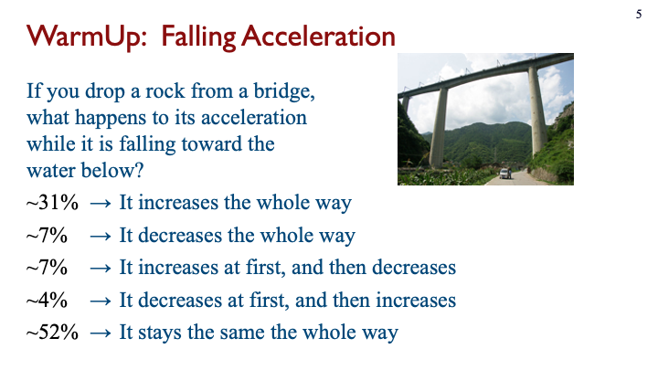

# Design spike 4 for [jitt](https://github.com/ivogeorg/jitt)

[[taag](https://patorjk.com/software/taag/#p=display&f=Big&t=something)]
```
  _____                                                 
 |_   _|                                                
   | |  _ __    _ __  _ __ ___   __ _ _ __ ___  ___ ___ 
   | | | '_ \  | '_ \| '__/ _ \ / _` | '__/ _ \/ __/ __|
  _| |_| | | | | |_) | | | (_) | (_| | | |  __/\__ \__ \
 |_____|_| |_| | .__/|_|  \___/ \__, |_|  \___||___/___/
               | |               __/ |                  
               |_|              |___/                   
```


# User stories

## 1. Instructor stories

1. I want to ask my students a small number of _questions_ (see [Question](#question)).  
   1. WarmUp is before class (optional deadline, etc.).  
   2. Lightning is live questions.  
2. What are questions?
   1. Questions have _optional_ meta-data.  
   2. A course label is meta-data of top priority. Course labels will appear on top of all questions as immediate filters.  
   3. Questions can be different type. Core kinds are:
      1. Essay.  
      2. Multiple-choice.  
      3. Multiple-answer.  
   4. Questions appear as richly-formatted markup [cards](#cards).   
   5. Expected clustering is meta-data.  
   6. Questions have versions, that can be shown together.  **TODO:** What are "versions", especially regarding whether two questions are versions or separate quesions?  
      1. Questions have "history".  
      2. (ivogeorg-2020-02-03) I think this matter is actually of great importance. Looking forward to a concept-graph representations of human concepts, the structure of the graph might be used to compose questions of various types and difficulty. So, even thought his might be an advanced feature further down the road (that is, not for MVP), the design of the system should anticipate it.
   7. Questions and their versions live like topic-centered clusters in questions banks. 
3. Interaction with questions:
   1. Before the semester. (Assemble a bank of questions for the course.)  
      1. Import from csv, spreadsheet, etc. and then arrange them.  ==> Bank building.    
      2. Import from a previous edition of the same class.  
      3. Import from another instructor that uses the system. ==> Bank building.  
      4. No particular order (e.g. syllabus is in flux).  
      5. Not homogenous (e.g. I am teaching two different levels). 
   2. Before the semester. (Bank available ==> Assignment building)
      1. Questions for a course from the bank by entering from course creation workflow with **breadcrumbs**, providing automatic course-usage metadata association.    
      2. New question creation should be integrate in the same view. 
         1. How do we associate a new question with question-bank questions?   
      4. Customize point value per question. Instructor can alter scale.
   3. During the semester. (The course trajectory changed in this class.)   
      1. Syllabus got rearranged (e.g. drilled down into a topic too early and that requires the next topics to appear in a slightly different order).  
      2. Change the wording.  
      3. Delete a question.  
      4. Move a questions backward or forward in the order, also in and out of the question bank.  
      5. Change the expected clustering.  
   4. After the semester. (Looking back on your life as an instructor :D)
      1. I want to be able to export questions to csv or spreadsheet.  
4. Interactions with responses:
   1. Grading.  
      1. Select among the following grading modes:
         1. Auto-grade for participation. For example, on a 0-2 scale, default to 1 for having provided an answer and 0 for no answer. 
         2. Auto-grade for correctness, for questions which have correct answers (e.g. multiple-choice, single-answer or multiple-answer, questions).
         3. No auto-grade (meaning, manual grading only). 
   2. Reviewing.  
      1. The view can be in two modes, squished and expanded. In squished, I can see as many answers as possible. In expanded, I can interact with the answers.  
      2. Interactions are:
         1. Adjust the default grade.  
         2. Manually adjust the grade for a student response at the same time (same view) as reviewing responses. Simple +/- buttons to increase/decrease grades. 
         3. Email individual students (from my default email client) about their response with one click from the basic "view responses" view.  
            1. Emails are based on templates.
            2. A template should be prefilled with available slot data. For example:
               1. Subject line.
               2. Greeting.
               3. The question.
               4. The addressee student's answer.
               5. Instructor signature.
            3. This feature may be scaled with clustering (a la [sense education](https://www.sense.education/):
               1. Grouping answers per question.  
               2. Clustering of a question's answers.
               3. Collecting instructor feedback on each cluster.
               4. Assembling instructor feedback for for each student (for all answered question).
               5. Mailing feedgack to each student.
         4. _Optionally, enter feedback for each answer cluster for each question and have the system broadcast stitched up responses to each student._  
         5. Manual clustering with on-the-fly category creation.  
         6. Flag for inclusion in a [digest](#digest). 
3. Digests.
   1. Examples:      
      Slide | Description
      --- | ---
        |  Contains a summary of a popular answer and a general "Conceptual problems" cluster/pool
        |  Contains two anonymized sample answers
        |  Contains three clusters with brief description
        |  Contains two anonymized sample (parts of) answers
        |  For a multiple-choice question, provides percentages for each answer
   2. _Manual clustering_ may have a very interesting UX/UI, in which, while the instructor is reviewing the answers, they can create clustering on the fly:
      1. If there is already a cluster category matching the highlight for an answer, it is selected to flag the answer.
      2. If an answer does not match any of the already available cluster categories, it is created on the fly, the answer is automatically flagged with it, and the category is added to the available one.
      3. Each set of cluster categories defines one "dimension". Multiple dimensions may be supported easily with the same UX/UI. A visual example:
         ```
         ---------------          ---------------          
         | DIMENSION 1 |          | DIMENSION 2 |          
         ---------------          ---------------          
         | Category 1  |          | Category 1  |          
         ---------------          ---------------          
         | Category 2  |          | Category 2  |          
         ---------------          ---------------          
         | Category 3  |          
         ---------------          
         | Category 4  |          
         ---------------          
         ```
      4. This is just like adding new folders in Gmail and hierarchical drill-down filtering as in this digital-library screenshot:  
            
         and also like the new [UI features of Chrome](https://www.google.com/chrome/tips/?utm_source=chrome&utm_medium=material-callout&utm_campaign=tipsq1_21&utm_content=did-you-know).  
      5. Automatic clustering can be presented in the same UX/UI, just populating the cluster dimensions and categories.  
   3. Sort student responses in a few ways. For example:
      1. By timestamp.
      2. Alphabetical by last name.
      3. Randomized. 
      4. Instructor requests "Random 15 responses at the top, from those I have seen the least." The system tallies which students are displayed at the top. The next time, those with the lowest tally are shown at the topic.
4. Ideally the student view of questions is LMS embeddable (like Canvas rich-editor **Embed**).  
5. System connects to the LMS via an [LTI](https://community.canvaslms.com/t5/Canvas-Basics-Guide/What-are-External-Apps-LTI-Tools/ta-p/57#:~:text=LTI%20provides%20a%20framework%20through,authenticity%20of%20the%20data%20sent.) so that there is no additional login required, that would be even better.  

### 1.1. Question banks

1. Questions can be flagged with conceptual topics.  
2. Questions can be flagged with question level, most likely to follow adopted and/or conventional scale of academic difficulty. 
   1. For example, for physics, these can be:
      1. Conceptual.  
      2. Algebra-based.   
      3. Calculus-based. 
      4. Upper-division.  
      5. Graduate-level.  
   2. This is a first step toward figuring out how to maintain domain knowledge in a hierarchy of academic difficulty.
   3. In general, these levels should be configurable by the instructor, though concensus and normativity are desired.  
3. Quesitons can be searched by users based on:
   1. Author.  
   2. Topic.  
   3. Question level.  
   4. Date.  
   5. Course name.   
4. Querstion banks are closely related to other forms of knowledge organization.  
   1. Concept graphs.  
   2. Concept inventories.  
   3. Curricula recommendations (e.g. [ce2016](http://www.acm.org/binaries/content/assets/education/ce2016-final-report.pdf)).  
   4. Conceptual change models.  
   
   
### 1.2. Metadata: Questions between banks and courses

Metadata is "tags", "labels", "GUIDs", ...

Question bank has (possibly loosely overlapping) metadata categories:
1. Knowledge graph (e.g. hierarchy of concepts, clustering of question versions, question sets that are asked together)  
   1. Folks: Concepts, Conceptual association, ...
2. Course usage (e.g. course level, course-semester-assignment, class-n-answers)  
   1. Folks: Course associations, ...
3. Presentation (e.g. question type, card elements (e.g. images, diagrams, drawings, etc.))   
   1. Folks: Design, ...
4. Provenance (e.g. author, etc.)  
   1. Folks: Origins, History, ...  
5. Usage stats (e.g. how many times, digests)  
   1. Folks: History, Answer stats, ...
                 
   
### 1.3. Cards

_Notes: Cards are semi-independent embeddable interactive units of rich multimedia content stored in JSON and MongoDB._

1. What is a card good for:
2. What can be a card:
   1. Questions, by default. 
   2. Answers, if interactive may optionally be, especially in the interactive case.
   3. Curated results in class.
3. What may a card contain:
   1. Textual paragraphs.
   2. Formulae.
   3. Images.
   4. Embedded video.
4. In general, cards should support a full (initially 2D) pallete of formatting options, organized as a set of content-dependent rich editors. _Note that the **bang-for-the-buck** declines sharply for such editors. The range is from **HTML** (or **LaTeX**, or **Photoshop**) to **Markdown**. Err on the side of simplicity._


## 2. Student stories

1. I want to have an easy interface to answer _warmup questions_ on any device.  
2. I want to have alerts about the pre-class deadlines for _warmup questions_.  
3. I want to be able to edit my answers before the corresponding deadline.  
4. I want to have the questions sent to me over email and apps that I use (e.g. Teams, FB Messenger).  
5. I want to be able to review questions, my responses and the grades I got, after the deadline.  

# Design spike protocol

1. ~Review [stories](#user-stories).~  
2. ~Answer [open questions](https://github.com/ivogeorg/jitt/blob/main/design-spike-2.md#open-questions).~  
3. ~Integrate notes on [digests](https://github.com/ivogeorg/jitt/blob/main/design-spike-2.md#7-digest).~  
4. ~Update [stories](#user-stories).~  
5. ~Integrate notes on [views](https://github.com/ivogeorg/jitt/blob/main/design-spike-2.md#views).~  
6. Design all [views](#views) based on [stories](#user-stories).  
7. Integrate notes on [workflows](https://github.com/ivogeorg/jitt/blob/main/design-spike-2.md#workflows). Workflows are a graph of [views](#views).  
8. Design all [workflows](#workflows) on the view graph.  
9. Design core [data](#data) using:
   1. GUID.  
   2. Description of relation to other _core data_.
      1. Associations can be many-to-many, many-to-one, one-to-many, and one-to-one.  
      2. Mappings are usually one-to-one or one-to-many (dictionary). In the one-to-one case they are _equivalences_.  
   3. **Unique**, e.g. email address.
   3. _Optional_, usually for _non-core data_.


# Views

_Notes: Views are formatted combinations of information, promptings, and editing elements. A view may contain [cards](#12-cards)._

## Hierarchical drill-down


## General notes
1. In the bank, questions are by default listed compactly, and they can be expanded one-by-one in place by a click.  
2. In the expanded question, some information will be one-click down for an extra expansion (e.g. historical usage).  
3. Questions for a course from the bank by entering from course creation workflow with **breadcrumbs**, providing automatic course-usage metadata association. 

## View list

### Instructor

1. Account.  
1. Question bank: list of questions.  
2. Question design: all details for a question.  
3. All courses.  
4. Course details.   
5. All assignments for a course.
6. Assignment design. 
7. Response review and digest creation.      
8. Digest presentation.  
9. Grades for all assignments in a course.
10. Student roster for a course.


### Student

1. Account.  
1. All courses.  
2. Course details.  
3. Course assignments with grades per asst.  
4. Assignment questions with grades per q.  
5. Assignment digests.  

## View details

#### Instructor-Account
#### Instructor-Question bank
#### Instructor-Question design
#### Instructor-All courses  
#### Instructor-Course details   
#### Instructor-All assignments for a course
#### Instructor-Assignment design 
#### Instructor-Response review and digest creation      
#### Instructor-Digest presentation  
#### Instructor-Grades for all assignments in a course  
#### Instructor-Student roster for a course  

#### Student-Account  
#### Student-All courses 
#### Student-Course details   
#### Student-Course assignments with grades
#### Student-Assignment questions with grades  
#### Student-Assignment digests  


# Workflows

  

# Data

