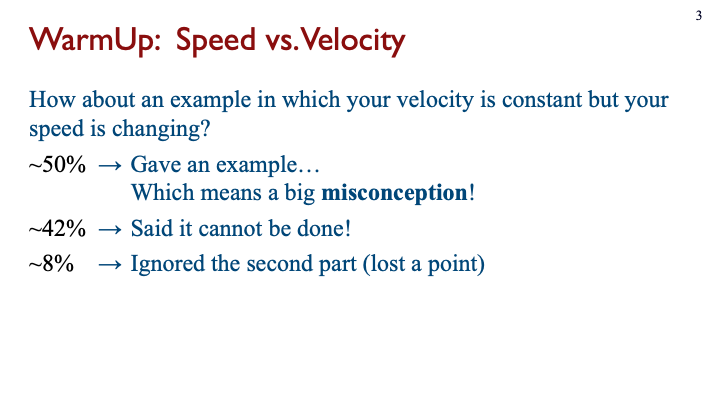
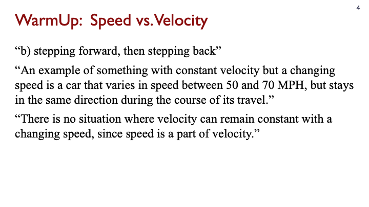

## 1. Instructor stories

1. I want to ask my students a small number of _questions_ (see [Question](#question)).  
   1. WarmUp is before class (optional deadline, etc.).  
   2. Lightning is live questions.  
2. What are questions?
   1. Questions have _optional_ meta-data.  
   2. A course label is meta-data of top priority. Course labels will appear on top of all questions as immediate filters.  
   3. Questions can be different type. Core kinds are:
      1. Essay.  
      2. Multiple-choice.  
      3. Multiple-answer.  
   4. Questions appear as richly-formatted markup [cards](#cards).   
   5. Expected clustering is meta-data.  
   6. Questions have versions, that can be shown together.  **TODO:** What are "versions", especially regarding whether two questions are versions or separate quesions?  
      1. Questions have "history".  
      2. (ivogeorg-2020-02-03) I think this matter is actually of great importance. Looking forward to a concept-graph representations of human concepts, the structure of the graph might be used to compose questions of various types and difficulty. So, even thought his might be an advanced feature further down the road (that is, not for MVP), the design of the system should anticipate it.
   7. Questions and their versions live like topic-centered clusters in questions banks. 
3. Interaction with questions:
   1. Before the semester. (Assemble a bank of questions for the course.)  
      1. No particular order (e.g. syllabus is in flux).  
      2. Not homogenous (e.g. I am teaching two different levels).  
   2. Before the semester. (Bank available ==> Assignment building)
      1. Questions for a course from the bank by entering from course creation workflow with **breadcrumbs**, providing automatic course-usage metadata association.    
      2. New question creation should be integrate in the same view. 
         1. How do we associate a new question with question-bank questions?   
   3. During the semester. (The course trajectory changed in this class.)   
      1. Syllabus got rearranged (e.g. drilled down into a topic too early and that requires the next topics to appear in a slightly different order).  
      2. Change the wording.  
      3. Delete a question.  
      4. Move a questions backward or forward in the order, also in and out of the question bank.  
      5. Change the expected clustering.  
2. For WarmUp, I want to be able to quickly review the answers (see [Answers](#answers)) for a question, and:
   1. The view can be in two modes, squished and expanded. In squished, I can see as many answers as possible. In expanded, I can interact with the answers.  
   2. Interactions are:
      1. Adjust the default grade.  
      2. Send private feedback to a student off a template. 
      3. _Optionally, enter feedback for each answer cluster for each question and have the system broadcast stitched up responses to each student._  
      4. Manual clustering with on-the-fly category creation.  
      5. Flag for inclusion in a [digest](#digest). 
3. Digest.
   1. Examples:      
      Slide | Description
      --- | ---
        |  Contains a summary of a popular answer and a general "Conceptual problems" cluster/pool
        |  Contains two anonymized sample answers
        |  Contains three clusters with brief description
        |  Contains two anonymized sample (parts of) answers
        |  For a multiple-choice question, provides percentages for each answer
   2. _Manual clustering_ may have a very interesting UX/UI, in which, while the instructor is reviewing the answers, they can create clustering on the fly:
      1. If there is already a cluster category matching the highlight for an answer, it is selected to flag the answer.
      2. If an answer does not match any of the already available cluster categories, it is created on the fly, the answer is automatically flagged with it, and the category is added to the available one.
      3. Each set of cluster categories defines one "dimension". Multiple dimensions may be supported easily with the same UX/UI. A visual example:
         ```
         ---------------          ---------------          
         | DIMENSION 1 |          | DIMENSION 2 |          
         ---------------          ---------------          
         | Category 1  |          | Category 1  |          
         ---------------          ---------------          
         | Category 2  |          | Category 2  |          
         ---------------          ---------------          
         | Category 3  |          
         ---------------          
         | Category 4  |          
         ---------------          
         ```
      4. This is just like adding new folders in Gmail and hierarchical drill-down filtering as in this digital-library screenshot:  
            
         and also like the new [UI features of Chrome](https://www.google.com/chrome/tips/?utm_source=chrome&utm_medium=material-callout&utm_campaign=tipsq1_21&utm_content=did-you-know).  
      5. Automatic clustering can be presented in the same UX/UI, just populating the cluster dimensions and categories.  
   3. Sort student responses in a few ways. For example:
      1. By timestamp.
      2. Alphabetical by last name.
      3. Randomized. 
      4. Instructor requests "Random 15 responses at the top, from those I have seen the least." The system tallies which students are displayed at the top. The next time, those with the lowest tally are shown at the topic.
5. I want to be able to import questions:
   1. From csv, spreadsheet, etc. and then arrange them.  ==> Bank building.    
   2. From a previous edition of the same class.  
   3. From another instructor that uses the system. ==> Bank building.  
6. I want to be able to export questions to csv or spreadsheet.  
8. I want the option to have the computer assign grades automatically (auto-grade) to student responses.  
   1. Select mode:
      1. Auto-grade for participation. For example, on a 0-2 scale, default to 1 for having provided an answer and 0 for no answer. 
      2. Auto-grade for correctness, for questions which have correct answers (e.g. multiple-choice, single-answer or multiple-answer, questions).
      3. No auto-grade (meaning, manual grading only). 
   2. Customize point value per question. That is, the scale is definable.   
   3. Manually adjust the grade for a student response at the same time (same view) as reviewing responses. Simple +/- buttons to increase/decrease grades.  **Addressed earlier? Remove?**
9. Email individual students (from my default email client) about their response with one click from the basic "view responses" view.  
   1. Emails are based on templates.
   2. A template should be prefilled with available slot data. For example:
      1. Subject line.
      2. Greeting.
      3. The question.
      4. The addressee student's answer.
      5. Instructor signature.
   3. This feature may be scaled with clustering (a la [sense education](https://www.sense.education/):
      1. Grouping answers per question.  
      2. Clustering of a question's answers.
      3. Collecting instructor feedback on each cluster.
      4. Assembling instructor feedback for for each student (for all answered question).
      5. Mailing feedgack to each student.
11. Ideally the student view of questions is LMS embeddable (like Canvas rich-editor **Embed**).  
12. System connects to the LMS via an [LTI](https://community.canvaslms.com/t5/Canvas-Basics-Guide/What-are-External-Apps-LTI-Tools/ta-p/57#:~:text=LTI%20provides%20a%20framework%20through,authenticity%20of%20the%20data%20sent.) so that there is no additional login required, that would be even better.  
